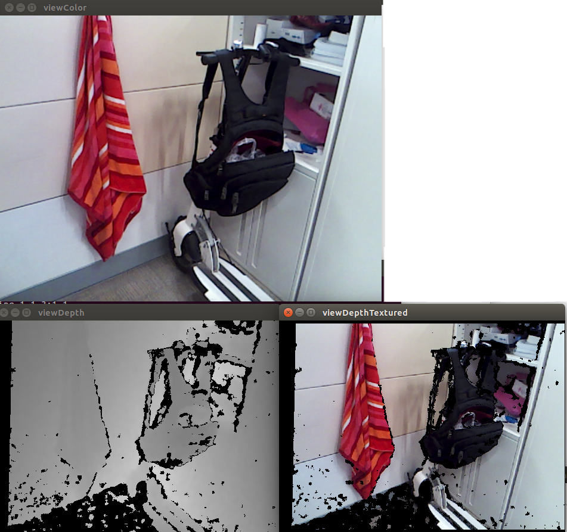

# Intel&reg; RealSense&trade; Sample Image Viewer Nodelet

Displaying image data from Intel&reg; RealSense&trade; 3D Cameras

## Subscribed Topics
    camera/depth/image_raw (sensor_msgs/Image)
        uint16 depths in mm.
    camera/depth/uv (std_msgs/Float32MultiArray)
        UV mapping for depth image.
    camera/color/image_raw (sensor_msgs/Image)
        Color rectified image. RGB format.

## Publisehd Topics
    None

## Parameters
    None

## Services
    None

## Version
    2.0

## Known issues:
-

## Running the Sample nodelet
Simply type:

    roslaunch realsense_sample realsense_image_viewer_launch.launch

This will launch the sample image viewer nodelet. You will see 3 windows apearing on the screen:

* The depth image
* The color image
* The depth image textured 

## Tech and dependencies 
* R200 or F200 nodelet
System:

* Linux 12.04+
* ROS Indigo
* F200/R200 (IVCAM/DS4) camera

** The ROS integration has been tested on a 64bit machine with Linux 14.04.01 and ROS Indigo.

## Installation

Add the files to your catkin workspace, build it and run the provided launch file.

